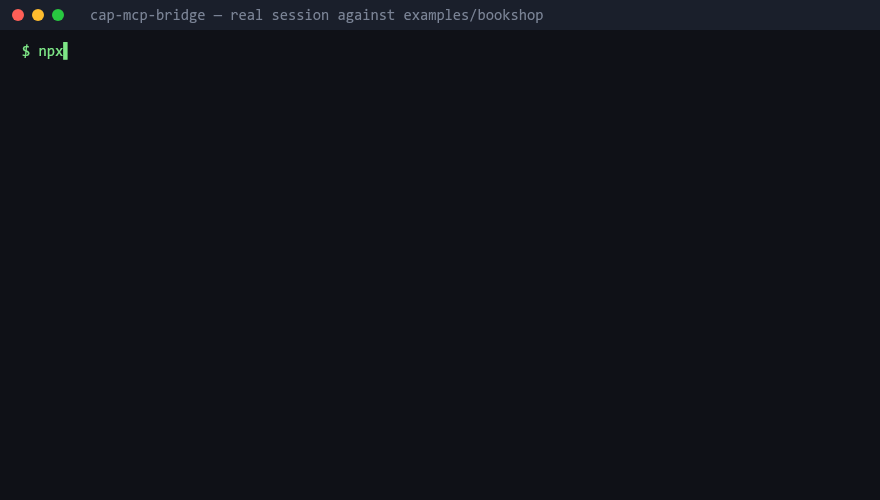

# cap-mcp-bridge

[](https://github.com/SanoberRehman/cap-mcp-bridge/actions/workflows/ci.yml)

Point it at any SAP CAP / OData v4 service. It reads the service's `$metadata` and turns it into
MCP tools an LLM can call: list, describe, query with validated filters, expand across
associations, invoke functions and actions. No per-service code, no hand-written tool definitions.
One config, and the service is queryable in natural language.



## 60-second quickstart

Against the public Northwind service (no auth):

```sh
npx cap-mcp-bridge --url https://services.odata.org/V4/Northwind/Northwind.svc
```

That starts an MCP server on stdio. Wire it into Claude Desktop (`claude_desktop_config.json`):

```json
{
  "mcpServers": {
    "northwind": {
      "command": "npx",
      "args": ["-y", "cap-mcp-bridge", "--url", "https://services.odata.org/V4/Northwind/Northwind.svc"]
    }
  }
}
```

Or Claude Code:

```sh
claude mcp add northwind -- npx -y cap-mcp-bridge --url https://services.odata.org/V4/Northwind/Northwind.svc
```

Then ask: *"Which German customers have orders shipped to Berlin? Include the company name."*

Against your own CAP service running locally with `cds watch`:

```sh
npx cap-mcp-bridge --url http://localhost:4004/odata/v4/catalog
```

To see what the bridge understood about a service without starting the server:

```sh
npx cap-mcp-bridge --url http://localhost:4004/odata/v4/catalog --print-model
```

## What the model gets

A fixed set of tools whose *schema* is discoverable, rather than four tools per entity set (a real
CAP service has 40+ entity sets, which would blow any tool budget):

| Tool | Purpose |
|---|---|
| `list_entity_sets` | Names, labels, record counts, draft flag, write capabilities, navigations |
| `describe_entity` | Full schema of one entity set: properties, types, keys, navigations, filterable/sortable fields |
| `query_entity` | The workhorse: filter, select, expand, orderBy, paging, `$count` |
| `get_entity` | One record by key |
| `invoke_function` | Call a read-only OData function (unbound or bound) |
| `invoke_action` | Call an action. **Write mode only** |
| `create_entity` / `update_entity` / `delete_entity` | **Write mode only** |
| `refresh_metadata` | Re-read `$metadata` after a redeploy; re-registers tools if entities changed |

Every entity schema is also an MCP **resource** at `cap://entity/{name}` (and `cap://service` for
the overview), so a client can pull schemas into context without spending a tool call.

**Typed per-entity tools.** With `toolMode: "auto"` (the default), a service with ≤ 12 entity sets
gets `query_Books`, `get_Orders`, ... instead, with `select` / `expand` / `orderBy` as enums of the
real property names. Easier for a model to call correctly, and affordable at that size. Set
`toolMode` to `generic` or `per-entity` to force either.

Every description is generated from the service's CDS annotations (`@title`, `@Core.Description`,
`@readonly`, `@mandatory`, `@Capabilities.*`, `@PersonalData.*`). Nothing is written per service.

## Related work

There is prior art in the CAP ecosystem, and the difference is architectural rather than a
feature list. Versions and descriptions below are from the npm registry at the time of writing.

| Package | What it is | Where it runs | What it reads |
|---|---|---|---|
| [`@gavdi/cap-mcp`](https://www.npmjs.com/package/@gavdi/cap-mcp) (1.8.0) | CAP plugin. Scans your service definitions for `@mcp` annotations and exposes annotated entities as MCP resources with OData v4 query capabilities, functions and actions as tools, plus prompt templates; optional entity wrappers add `query` / `get` / `create` / `update` tools. Serves MCP from the CAP app itself at `/mcp`, inheriting the app's authentication. | Inside the CAP application (`npm install` into the CAP project) | CAP's compiled model and your `@mcp` annotations |
| [`@neoimpulse/cap-js-mcp`](https://www.npmjs.com/package/@neoimpulse/cap-js-mcp) (1.0.6) | CAP plugin with API-key authentication and configurable directories for your own tools, prompts and resources. Its default tools are `search_model` and `search_docs`, described as a generic implementation based on the SAP server below, using `cds.model` from the running app. The README marks `search_docs` as a placeholder, and the npm description is unrelated boilerplate. | Inside the CAP application | The running app's `cds.model` |
| [`@cap-js/mcp-server`](https://www.npmjs.com/package/@cap-js/mcp-server) (0.0.5) | SAP's own MCP server, aimed at *developers building CAP apps* ("AI-assisted development of CAP applications"): `search_model` over a project's compiled CDS definitions and `search_docs` over the CAP documentation. It does not query a running service's data. | As a separate process (`npx -y @cap-js/mcp-server`) against a CAP project on disk | The project's CDS sources and the CAP docs |
| `cap-mcp-bridge` (this project) | A generic OData v4 client exposed as MCP tools: query, get, expand, functions, actions, with schema-validated filters and safety rails. | As a separate process, anywhere with HTTP access to the service | `$metadata` over HTTP, nothing else |

The two plugins run **inside** the CAP application: you add them to the CAP project's
`package.json`, and they read CAP's runtime model after the app compiles. `cap-mcp-bridge` runs
**outside** the service and consumes `$metadata` over HTTP. That cuts both ways:

- **Where the bridge is the better fit:** services you do not own, cannot modify, or cannot
  redeploy. Third-party SAP systems, locked-down production landscapes, and any non-CAP OData v4
  service. It is the reason the Northwind example works at all: there is no CAP application to
  install a plugin into.
- **Where the plugins are the better fit:** if you own the CAP application and can add a
  dependency. In-process access to the compiled CDS model gives them richer semantics than an EDMX
  document exposes (CAP-specific annotations that never reach `$metadata`, custom handlers, the
  app's own authentication and authorisation applied per user), and there is no second process to
  run or secure. `@gavdi/cap-mcp` in particular lets you curate exactly what is exposed through
  `@mcp` annotations, which is a more deliberate surface than "everything in the metadata".

If you are writing the CAP service yourself, look at the plugins first. If you are pointed at
someone else's OData endpoint, this is the tool.

## Filters that self-correct

`$filter` as a raw string is where LLM-driven OData goes wrong: quoting, date literals, `eq null`,
function syntax. So the preferred form is structured, and the bridge does the quoting:

```json
{
  "entitySet": "Orders",
  "filter": {
    "and": [
      { "field": "ShipCountry", "op": "eq", "value": "Germany" },
      { "field": "Freight", "op": "gt", "value": "100" },
      { "field": "OrderDate", "op": "ge", "value": "1997-01-01" }
    ]
  },
  "select": ["OrderID", "ShipCity", "Freight"],
  "expand": ["Customer"],
  "orderBy": [{ "field": "Freight", "dir": "desc" }],
  "top": 20
}
```

becomes `$filter=ShipCountry eq 'Germany' and Freight gt 100 and OrderDate ge 1997-01-01`. Raw
`$filter` strings are accepted too; they are parsed, validated against the schema, and re-serialised.

Both forms go through the same validator: every field must exist, be filterable/sortable per the
service's `Capabilities` annotations, the operator must be legal for the type, and the literal
must match it. On failure the model gets something it can act on, before anything reaches the
network:

```json
{
  "error": {
    "code": "not_filterable",
    "message": "\"Picture\" is not filterable on Categories. Filterable fields: CategoryID, CategoryName, Description",
    "target": "Picture",
    "validOptions": ["CategoryID", "CategoryName", "Description"]
  }
}
```

A model that gets this will self-correct on the next turn. A model that gets `400 Bad Request` will not.

**Drafts.** For CAP draft-enabled entities the bridge injects `IsActiveEntity eq true` unless the
caller passes `includeDrafts: true`, and key lookups default to the active record. Without this,
every query on a draft entity returns duplicate rows.

## Safety rails

This is what makes the bridge deployable rather than a toy. All on by default:

- **Read-only by default.** Write tools only exist when `writeEnabled: true` (`--write`).
- **Forced pagination.** `$top` defaults to 25, hard cap 200. `$count` is always requested. When
  there is more, the response says so and gives `nextSkip`.
- **Response size ceiling.** ~50KB per response. Rows are dropped from the end with an explicit
  note saying how many and why. Never silently.
- **Entity allowlist / denylist** by name or glob (`entityAllow`, `entityDeny`).
- **Field redaction.** A configurable list of names/globs (`redactFields`), plus automatic redaction
  of anything annotated `@PersonalData.IsPotentiallySensitive`. Applied inside expanded navigations too.
- **Timeouts and retries.** 30s timeout. Retry with backoff on 5xx and 429 only. Never a 4xx,
  never a write.
- **Logs** go to stderr and never contain tokens, passwords, or URLs with filter values.

## Configuration

Precedence: CLI flags > `CAP_MCP_*` environment > `cap-mcp.config.json` > defaults.

| JSON key | Env var | Default | Meaning |
|---|---|---|---|
| `url` | `CAP_MCP_URL` | required | OData v4 service root |
| `auth.kind` | `CAP_MCP_AUTH` | `none` | `none` \| `basic` \| `bearer` \| `oauth2-cc` |
| `auth.username` / `auth.password` | `CAP_MCP_USERNAME` / `CAP_MCP_PASSWORD` | | basic auth |
| `auth.token` | `CAP_MCP_TOKEN` | | bearer token passed through |
| `auth.tokenUrl` / `clientId` / `clientSecret` | `CAP_MCP_TOKEN_URL` / `CAP_MCP_CLIENT_ID` / `CAP_MCP_CLIENT_SECRET` | | XSUAA client credentials |
| | `CAP_MCP_SERVICE_KEY_FILE` | | XSUAA service key JSON; fills the three above |
| `transport` | `CAP_MCP_TRANSPORT` | `stdio` | `stdio` \| `http` |
| `host` / `port` | `CAP_MCP_HOST` / `CAP_MCP_PORT` | `127.0.0.1` / `3333` | HTTP bind address; port `0` picks a free one |
| `toolMode` | `CAP_MCP_TOOL_MODE` | `auto` | `generic` \| `per-entity` \| `auto` |
| `perEntityThreshold` | `CAP_MCP_PER_ENTITY_THRESHOLD` | `12` | `auto` switches to generic above this many entity sets |
| `writeEnabled` | `CAP_MCP_WRITE_ENABLED` | `false` | register write tools |
| `defaultTop` / `maxTop` | `CAP_MCP_DEFAULT_TOP` / `CAP_MCP_MAX_TOP` | `25` / `200` | paging |
| `maxResponseBytes` | `CAP_MCP_MAX_RESPONSE_BYTES` | `50000` | response ceiling |
| `entityAllow` / `entityDeny` | `CAP_MCP_ENTITY_ALLOW` / `CAP_MCP_ENTITY_DENY` | | names or globs, comma-separated in env |
| `redactFields` | `CAP_MCP_REDACT_FIELDS` | | names or globs |
| `timeoutMs` / `maxRetries` | `CAP_MCP_TIMEOUT_MS` / `CAP_MCP_MAX_RETRIES` | `30000` / `3` | |
| `metadataTtlMs` | `CAP_MCP_METADATA_TTL_MS` | `900000` | metadata cache TTL (15 min) |
| `logLevel` | `CAP_MCP_LOG_LEVEL` | `info` | `debug` \| `info` \| `warn` \| `error` \| `silent` |

Auth kind is inferred when omitted: a token implies `bearer`, a client id implies `oauth2-cc`, a
username implies `basic`.

### Auth against a BTP-deployed CAP service

```sh
export CAP_MCP_URL=https://<app>.cfapps.<region>.hana.ondemand.com/odata/v4/catalog
export CAP_MCP_SERVICE_KEY_FILE=./service-key.json   # XSUAA service key from the cockpit
npx cap-mcp-bridge
```

The token is cached, refreshed 60s before expiry, and fetched single-flight so concurrent tool
calls never stampede the token endpoint. See [examples/btp](examples/btp).

### Streamable HTTP

```sh
npx cap-mcp-bridge --url ... --transport http --port 3333
# POST/GET/DELETE http://127.0.0.1:3333/mcp, health at /healthz
```

One MCP server per session, all sharing the metadata cache and auth provider.

### Docker

```sh
docker build -t cap-mcp-bridge .
docker run --rm -p 3333:3333 -e CAP_MCP_URL=https://services.odata.org/V4/Northwind/Northwind.svc cap-mcp-bridge
```

The image runs the HTTP transport bound to `0.0.0.0:3333`. Pass any `CAP_MCP_*` variable.

## Examples

- [examples/northwind](examples/northwind): public service, generic tools, deny list and redaction in use
- [examples/bookshop](examples/bookshop): a small CAP service with every annotation the bridge understands, drafts included. Also the local acceptance target.
- [examples/btp](examples/btp): XSUAA client credentials

## How it works

```
$metadata ──► metadata/  parse EDMX → ServiceModel (annotations folded in, drafts detected)
                 │
                 ▼
             tools/      ServiceModel → MCP tools + resources (generic or typed per-entity)
                 │
                 ▼
             odata/      validate filter/select/expand/orderBy → build URL → auth, retry, paging
                 │
                 ▼
             server/     stdio or streamable HTTP
```

The `ServiceModel` is the only contract between layers. Adding support for a new CAP service
requires zero code changes because the only input is XML. Design notes and the decisions behind
them are in [docs/ARCHITECTURE.md](docs/ARCHITECTURE.md).

Type mapping worth knowing: `Edm.Decimal` is exposed as a **string** (CAP serialises decimals as
strings to avoid float precision loss; the bridge also sends `IEEE754Compatible=true`). Field
descriptions say so.

## Development

```sh
npm install
npm run typecheck && npm run lint && npm test
npm run dev -- --url https://services.odata.org/V4/Northwind/Northwind.svc --print-model
npx tsx scripts/smoke.ts https://services.odata.org/V4/Northwind/Northwind.svc   # live, over stdio
```

The end-to-end tests run a real `McpServer` and `Client` over an in-memory transport with `fetch`
stubbed to serve fixture metadata, plus real HTTP servers for the auth and transport suites. The
bookshop under `examples/bookshop` provides the CAP fixture (`npx cds compile srv --to edmx-v4`).

### Cutting a release

Releases are published by GitHub Actions ([release.yml](.github/workflows/release.yml)) through
npm trusted publishing (OIDC). There is no `NPM_TOKEN` secret, and the package page carries a
provenance badge linking the tarball to the exact commit and workflow run.

```sh
# 1. on main, bump the version and record the changes
npm version 0.2.0 --no-git-tag-version      # edits package.json + package-lock.json
#    add a 0.2.0 section to CHANGELOG.md, open a PR, merge it
# 2. tag the merged commit and push the tag; the workflow publishes
git checkout main && git pull
git tag v0.2.0 && git push origin v0.2.0
```

The workflow refuses to publish if the tag does not match `package.json`. One-time setup: npm
only lets you register a trusted publisher for a package that already exists, so the very first
version is published by hand (`npm publish`, with 2FA), after which the trusted publisher is added
on npmjs.com under the package's Settings (GitHub Actions, repository
`SanoberRehman/cap-mcp-bridge`, workflow `release.yml`). Provenance is requested only by the
workflow (`--provenance`); a manual publish from a laptop cannot generate it, so it is not set in
`publishConfig`.

### Post-publish check

```sh
bash scripts/verify-published.sh            # cap-mcp-bridge@latest
bash scripts/verify-published.sh 0.1.0      # a specific version
```

It runs `npx -y cap-mcp-bridge@<version> --print-model` against Northwind from a fresh temp
directory with a fresh npm cache, so nothing resolves from this repository. It is what catches a
missing shebang, an unbuilt `dist`, or a `files` array that left something out.

## License

MIT
